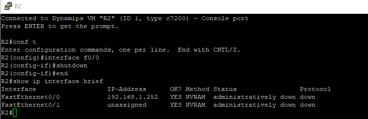

[](https://developer.cisco.com/codeexchange/github/repo/cherifimehdi/Retrieve_Data_Application_Case)

# Efficient Network Devices Data Retrieving - Application case of Validate/Monitor access to network devices with the integration of Genie/pyATS, WebEx Messenger and Syslog server use case

<div style="text-align: justify">

This project shows an efficent and optimized way to retrieve data from network devices with checking access process by leveraging the [Validate/Monitor access to network devices with the integration of Genie/pyATS, WebEx Messenger and Syslog server](https://developer.cisco.com/network-automation/detail/31f2a492-d5b7-11eb-95a0-c6918c6fb71b/) use case relating with the project [Check_Access](https://developer.cisco.com/codeexchange/github/repo/cherifimehdi/Check_Access).

Suppose we have 100 network devices and we have access only to 50 of them, the retriving data process is applied only to these 50 devices witch conduct to save the time with generating logs to Syslog server for maintenance purposes besides the report sent to WebEx Messenger Space.

In summary, this project aims to : 

- Check if there is an access to the network devices and generating notification for eeach of them to Syslog server and as report incorporated in text file to WebEx Messenger Space.
- Retrieve data only form devices on witch there is access and generate notifications to Syslog server for both case : Retrieving Success or Not 
      
# Remark
We focus here only on the result for the Syslog server notifications and the package installation and requirements, the others details like configuration files modification, topology and the WebEx Messenger result could be found at [Check_Access](https://developer.cisco.com/codeexchange/github/repo/cherifimehdi/Check_Access) repository related to [Validate/Monitor access to network devices with the integration of Genie/pyATS, WebEx Messenger and Syslog server](https://developer.cisco.com/network-automation/detail/31f2a492-d5b7-11eb-95a0-c6918c6fb71b/) use case as it is a part of this project.
      
For testing purposes, the topology used here is the same as that used in the [Check_Access](https://developer.cisco.com/codeexchange/github/repo/cherifimehdi/Check_Access) project
      
# Packages installation and Requierements

The best practice is to leverage Python Virtual Environments (env). Please follow these steps to clone the Git repository and create and active the virtual environment:

```
git clone https://github.com/cherifimehdi/Retrieve_Data_Application_Case.git
cd Retrieve_Data_Application_Case
python3 -m venv venv
source venv/bin/activate
pip3 install -r requirements.txt
```
As the packages used are found in requirements.txt file, alternatively, you can install the packages as follows:
```
pip3 install pyats[full]
pip3 install requests
pip3 install requests-toolbelt
pip3 install prettytable
pip3 install python-dotenv
```

# Retrieve_Data_Application_Case in action

The command __show ip interface brief__ is used here for testing the data retrieving process

## In case of access

Here we run __retrieve_data_application_case.py__ script from the __Admin__ host:

```console
(Retrieve_Data_Application_Case) [mehdi@Retrieve_Data_Application_Case]$python  retrieve_data_application_case.py

+--------------------+
|    Access Check    |
+--------+-----------+
| Device |   Status  |
+--------+-----------+
|   R1   | Access Ok |
|   R2   | Access Ok |
|   R3   | Access Ok |
+--------+-----------+
0000000000000000000000000000000000000000000000000000000000000000000000000000000000000000000000000000
Result for R1
0000000000000000000000000000000000000000000000000000000000000000000000000000000000000000000000000000
{'interface': {'FastEthernet0/0': {'interface_is_ok': 'YES',
                                   'ip_address': '192.168.1.251',
                                   'method': 'NVRAM',
                                   'protocol': 'up',
                                   'status': 'up'},
               'FastEthernet0/1': {'interface_is_ok': 'YES',
                                   'ip_address': 'unassigned',
                                   'method': 'NVRAM',
                                   'protocol': 'down',
                                   'status': 'administratively down'}}}
0000000000000000000000000000000000000000000000000000000000000000000000000000000000000000000000000000
0000000000000000000000000000000000000000000000000000000000000000000000000000000000000000000000000000
Result for R2
0000000000000000000000000000000000000000000000000000000000000000000000000000000000000000000000000000
{'interface': {'FastEthernet0/0': {'interface_is_ok': 'YES',
                                   'ip_address': '192.168.1.252',
                                   'method': 'NVRAM',
                                   'protocol': 'up',
                                   'status': 'up'},
               'FastEthernet0/1': {'interface_is_ok': 'YES',
                                   'ip_address': 'unassigned',
                                   'method': 'NVRAM',
                                   'protocol': 'down',
                                   'status': 'administratively down'}}}
0000000000000000000000000000000000000000000000000000000000000000000000000000000000000000000000000000
0000000000000000000000000000000000000000000000000000000000000000000000000000000000000000000000000000
Result for R3
0000000000000000000000000000000000000000000000000000000000000000000000000000000000000000000000000000
{'interface': {'FastEthernet0/0': {'interface_is_ok': 'YES',
                                   'ip_address': '192.168.1.253',
                                   'method': 'NVRAM',
                                   'protocol': 'up',
                                   'status': 'up'},
               'FastEthernet0/1': {'interface_is_ok': 'YES',
                                   'ip_address': 'unassigned',
                                   'method': 'NVRAM',
                                   'protocol': 'down',
                                   'status': 'administratively down'}}}
0000000000000000000000000000000000000000000000000000000000000000000000000000000000000000000000000000
```

Here the result sent to the Syslog Server:


As show, the result indicate a successful in the access and the retrieving data processes for the three routers.

# In case of access problem

Now we will deactivate the management interface of the router __R2__


Now we run the __retrieve_data_application_case.py__ script from the __Admin__ host:

```console
(Retrieve_Data_Application_Case [mehdi@Retrieve_Data_Application_Case]$ python retrieve_data_application_case.py

+--------------------+
|    Access Check    |
+--------+-----------+
| Device |   Status  |
+--------+-----------+
|   R1   | Access Ok |
|   R2   | No Access |
|   R3   | Access Ok |
+--------+-----------+
0000000000000000000000000000000000000000000000000000000000000000000000000000000000000000000000000000
Result for R1
0000000000000000000000000000000000000000000000000000000000000000000000000000000000000000000000000000
{'interface': {'FastEthernet0/0': {'interface_is_ok': 'YES',
                                   'ip_address': '192.168.1.251',
                                   'method': 'NVRAM',
                                   'protocol': 'up',
                                   'status': 'up'},
               'FastEthernet0/1': {'interface_is_ok': 'YES',
                                   'ip_address': 'unassigned',
                                   'method': 'NVRAM',
                                   'protocol': 'down',
                                   'status': 'administratively down'}}}
0000000000000000000000000000000000000000000000000000000000000000000000000000000000000000000000000000
NO Retrieving Data Process for R2 : Refer to Result.txt for more infos
0000000000000000000000000000000000000000000000000000000000000000000000000000000000000000000000000000
Result for R3
0000000000000000000000000000000000000000000000000000000000000000000000000000000000000000000000000000
{'interface': {'FastEthernet0/0': {'interface_is_ok': 'YES',
                                   'ip_address': '192.168.1.253',
                                   'method': 'NVRAM',
                                   'protocol': 'up',
                                   'status': 'up'},
               'FastEthernet0/1': {'interface_is_ok': 'YES',
                                   'ip_address': 'unassigned',
                                   'method': 'NVRAM',
                                   'protocol': 'down',
                                   'status': 'administratively down'}}}
0000000000000000000000000000000000000000000000000000000000000000000000000000000000000000000000000000
```

As expected, the Syslog server received the logs:


From the results from the console and the Syslog server, we observe that there is no data retrieved from the router __R2__ and this process was escaped because there was no access to it which conducted to save the time.  

# About me

Active Cisco CCAI Instructor and Network Engineering Trainer. Part of Cisco DevNet Class 2020. Cisco DevNet Code Exchange and Automation Exchange Contributor.
I am interesting in all about NetDevOps, Networking programmability and automation. I am a Cisco contents fan.
      
## Contact Me

[LinkedIn](https://www.linkedin.com/in/mehdi-cherifi) 

[GitHub](https://github.com/cherifimehdi)

[Credly](https://www.credly.com/users/mehdi-cherifi/badges)

[Twitter](https://twitter.com/LocketKeepsake)

